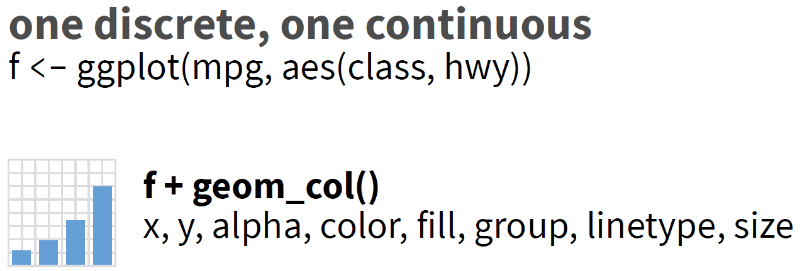
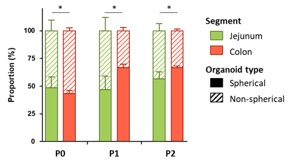

# **Packages et rappels**

## Packages


```r
## data
library(palmerpenguins)

## data management
library(dplyr)
## 
## Attachement du package : 'dplyr'
## Les objets suivants sont masqués depuis 'package:stats':
## 
##     filter, lag
## Les objets suivants sont masqués depuis 'package:base':
## 
##     intersect, setdiff, setequal, union
library(tidyr)

## graphics
library(ggplot2)
library(ggsignif)
```

<br>

>Rappel:  
**Raccourcis pour obtenir le pipe: `Ctrl + Alt + M`**  
 - |> si pipe natif de R activé (Tools - Global Options - Code)  
 - sinon %>% pipe de magrittr (repris par dplyr)

## Rappel pour construire un barplot avec le package ggplot2

### Structure minimale


<br><br>

DATA = data.frame  
GEOM_FUNCTION = type de graph  
MAPPINGS = association axes/variables  

<br>

### **`geom_bar()` ou `geom_col()`**

<br><br>

<div class="figure" style="text-align: center">

<p class="caption">https://raw.githubusercontent.com/rstudio/cheatsheets/main/data-visualization.pdf</p>
</div>

<br><br>

<div class="figure" style="text-align: center">

<p class="caption">https://raw.githubusercontent.com/rstudio/cheatsheets/main/data-visualization.pdf</p>
</div>

<br><br>

<center> <h1>**geom_bar()**</h1> </center>

### Plot de base sur la variable discrete `island` du jeu de données `penguins`

#### Synthaxe de la cheatsheet


```r
ggplot(data = penguins) + 
  geom_bar(mapping = aes(x = island))
```

<!-- -->

#### Synthaxe la plus utilisée  


```r
penguins |> 
  ggplot(aes(x = island)) + 
  geom_bar()
```

<!-- -->

#### Barplot horizontal en inversant les axes x <-> y


```r
penguins |> 
  ggplot(aes(y = island)) + 
  geom_bar()
```

<!-- -->


#### En mappant directement dans le geom, on peut ajouter d'autres variables à la suite


```r
penguins |> 
  ggplot() + 
  geom_bar(aes(x = island)) +
  geom_bar(aes(x = species))
```

<!-- -->

> Sur l'axe des y est reporté l'effectif de chaque niveau (level) de la variable mappée

#### Le `geom_bar()` ne s'applique pas aux variables continues


```r
penguins |> 
  ggplot(aes(x = bill_length_mm )) + 
  geom_bar() 
```

```
## Warning: Removed 2 rows containing non-finite values (stat_count).
```

<!-- -->

> ggplot élimine les NA's

#### Il faut utiliser un histogramme


```r
penguins |> 
  ggplot(aes(x = bill_length_mm)) +
  geom_histogram()
```

```
## `stat_bin()` using `bins = 30`. Pick better value with `binwidth`.
```

```
## Warning: Removed 2 rows containing non-finite values (stat_bin).
```

<!-- -->

### Mappings 2 variables ou plus

#### Ajout de la couleur

> Attention 2 paramètres pour appliquer des couleurs:  
 - color pour les bordures des barres  
 - fill (remplir) pour l'intérieur des barres  

ggplot ajoute automatiquement la légende  


```r
penguins |> 
  ggplot(aes(x = island,
             fill = island)) + 
  geom_bar()
```

<!-- -->


```r
penguins |> 
  ggplot(aes(x = island,
             color = island)) + 
  geom_bar()
```

<!-- -->

#### On peut utiliser la couleur pour visualiser une deuxième variable discrete


```r
penguins |> 
ggplot(aes(x = island, 
           fill = species)) +
  geom_bar()
```

<!-- -->

<center> <h1>**Faceting**</h1> </center>

#### Le faceting permet de rajouter encore une troisième discrete en répartissant les graphes associés à chaque level dans un panneau différent

**2 functions:**

 - `facet_wrap()`
 - `facet_grid()`

**2 modes d'affichages différents**

 - `facet_wrap()` affiche les panneaux les uns à la suite des autres dans un cadre donné
 - `facet_grip()` affiche les panneaux sur une grille définie par les différents niveaux

**Utilisation**

 - `facet_wrap()` pour une variable
 - `facet_grip()` pour la combinaison de 2 variables
 
**Paramètres d'affichage**

 - `facet_wrap()` ncol, nrow: cadre dans lequel sont affichés les panneaux (remplissage par ligne, comme un vecteur dans une matrice)
 - `facet_grip()` cols, rows: association des variables aux lignes et colonnes

> Remarques:  
  facet_grid peut afficher des panneaux vides si la combinaison n'a pas de graph  
  Si facet_wrap avec combinaisons de 2 variables (var1 ~ var2), les combinaisons vides ne seront pas affichées

#### Facet_wrap()

**Faceting par le sexe**


```r
penguins |> 
  ggplot(aes(x = island,
             fill = species)) +
  geom_bar() +
  facet_wrap(vars(sex))
```

<!-- -->

**Faceting par le sexe sur 3 lignes**


```r
penguins |> 
  ggplot(aes(x = island,
             fill = species)) +
  geom_bar() +
  facet_wrap(vars(sex), nrow = 3)
```

<!-- -->

**Faceting par les iles et l'espèce sur 2 lignes**


```r
penguins |> 
  ggplot(aes(x = island,
             fill = species)) +
  geom_bar() +
  facet_wrap(island ~ species, nrow = 2)
```

<!-- -->

#### Facet_grid()

**Faceting par le sexe**


```r
penguins |> 
  ggplot(aes(x = island,
             fill = species)) +
  geom_bar() +
  facet_grid(cols = vars(sex))
```

<!-- -->

**Faceting par le sexe en ligne**


```r
penguins |> 
  ggplot(aes(x = island,
             fill = species)) +
  geom_bar() +
  facet_grid(rows = vars(sex))
```

<!-- -->

**Faceting par les iles et l'espèce**


```r
penguins |> 
  ggplot(aes(x = island,
             fill = species)) +
  geom_bar() +
  facet_grid(rows = vars(island),
             cols = vars(species))
```

<!-- -->

<br><br>

### 3 mode d'affichage des barres quand 2 variables

#### Mode dodge (côte-à-côte)


```r
penguins |> 
  ggplot(aes(x = island,
             fill = species)) +
  geom_bar(position = "dodge")
```

<!-- -->

#### Mode stack (empilé) 


```r
penguins |> 
  ggplot(aes(x = island,
             fill = species)) +
  geom_bar(position = "stack")
```

<!-- -->

#### Mode fill (normalisé à 1)


```r
penguins |> 
  ggplot(aes(x = island,
             fill = species)) +
  geom_bar(position = "fill")
```

<!-- -->

<center> <h1>**geom_col()**</h1> </center>

### Plot de base sur la variable continue `body_mass_g`

#### La fonction `ggplot()` prépare les axes en fonction des variables associées (mapped) dans `aes()`  


```r
penguins |>  
  ggplot(aes(x = species,
             y = body_mass_g))
```

<!-- -->

#### Rajout de la couche `geom_col()`


```r
penguins |>  
  ggplot(aes(x = species,
             y = body_mass_g)) + 
  geom_col()
```

```
## Warning: Removed 2 rows containing missing values (position_stack).
```

<!-- -->

#### Rajout de la couleur avec la légende


```r
penguins |>  
  ggplot(aes(x = species,
             y = body_mass_g,
             fill = species)) + 
  geom_col()
```

```
## Warning: Removed 2 rows containing missing values (position_stack).
```

<!-- -->

#### Afficher la moyenne des poids par espèce

> Attention il y a des NA's  
  Ne pas oublier de rajouter `na.rm = T` au calul de la moyenne


```r
penguins |> 
  group_by(species) |> 
  summarise(mean = mean(body_mass_g, na.rm = T))
```

```
## # A tibble: 3 × 2
##   species    mean
##   <fct>     <dbl>
## 1 Adelie    3701.
## 2 Chinstrap 3733.
## 3 Gentoo    5076.
```

ggplot prend en entrée un data.frame résultat du calcul des moyennes


```r
penguins |> 
  group_by(species) |> 
  summarise(mean = mean(body_mass_g, na.rm = T)) |> 
  ggplot(aes(x = species,
             y = mean,
             fill = species)) + 
  geom_col()
```

<!-- -->

#### Affiche la moyenne des poids par espèce et par ile

> Attention:
ne pas oublier d'inclure la variable `island` dans le `group_by` pour le calcul des moyennes

> Utiliser la position "dodge" pour une meilleure lisibilité sur l'axe des y


```r
penguins |>  
  group_by(species, island) |> 
  summarise(mean = mean(body_mass_g, na.rm = T))
```

```
## `summarise()` has grouped output by 'species'. You can override using the
## `.groups` argument.
```

```
## # A tibble: 5 × 3
## # Groups:   species [3]
##   species   island     mean
##   <fct>     <fct>     <dbl>
## 1 Adelie    Biscoe    3710.
## 2 Adelie    Dream     3688.
## 3 Adelie    Torgersen 3706.
## 4 Chinstrap Dream     3733.
## 5 Gentoo    Biscoe    5076.
```


```r
penguins |>  
  group_by(species, island) |> 
  summarise(mean = mean(body_mass_g, na.rm = T)) |> 
  ggplot(aes(x = species,
             y = mean,
             fill = island)) + 
  geom_col(position = "dodge")
```

```
## `summarise()` has grouped output by 'species'. You can override using the
## `.groups` argument.
```

<!-- -->

#### Faceting par le sexe


```r
penguins |>  
  group_by(species, island, sex) |> 
  summarise(mean = mean(body_mass_g, na.rm = T)) |> 
  ggplot(aes(x = species,
             y = mean,
             fill = island)) + 
  geom_col(position = "dodge") +
  facet_grid(cols = vars(sex))
```

```
## `summarise()` has grouped output by 'species', 'island'. You can override using
## the `.groups` argument.
```

<!-- -->

<center> <h1>**Customisation**</h1> </center>

Il y a 3 familles de fonctions:

 - `scale_xx_xxx()`: customisation en fonction des données
 - `theme()`: customisation générale de tous les graphes d'un projet
 - `labs()`: customisation générale d'un graphe
 
> Néanmoins il peut y avoir plusieurs méthodes pour modifier un élément d'un graph  
En choisir une et s'y tenir pour une meilleure lisibilité et éviter les confusions
 
<center> <h2>**`geom_bar()`**</h2> </center>

### Changer l'ordre des niveaux sur l'axe des x et dans la légende

**Graphe de départ**


```r
penguins |>  
  ggplot(aes(x = species,
             fill = species)) + 
  geom_bar()
```

<!-- -->

**Changer l'ordre des niveaux directement**

> le titre de l'axe des x est changé


```r
penguins |>  
  ggplot(aes(x = factor(species, levels = c("Chinstrap", "Adelie", "Gentoo")),
             fill = species)) + 
  geom_bar()
```

<!-- -->

**Changer l'ordre des niveaux avec un objet**

> le titre de l'axe des x prend le nom de l'objet


```r
correct_order <- factor(penguins$species, levels = c("Chinstrap", "Adelie", "Gentoo"))
penguins |>  
  ggplot(aes(x = correct_order,
             fill = species)) + 
  geom_bar()
```

<!-- -->

**Même méthode pour la légende**


```r
correct_legend <- factor(penguins$species, levels = c("Chinstrap", "Adelie", "Gentoo"))
penguins |>  
  ggplot(aes(x = correct_order,
             fill = correct_legend)) + 
  geom_bar()
```

<!-- -->

### Changer les couleurs

Il faut tout d'abord associer à chaque niveau une couleur.

**Nouvelles couleurs pour les espèces**


```r
correct_col <- c("Chinstrap" = "dodgerblue3", 
                 "Adelie" = "purple", 
                 "Gentoo" = "yellowgreen")
```

Utiliser la fonction `scale_fill_manual()` une fois le graphe construit.  


```r
penguins |>  
  ggplot(aes(x = species,
             fill = species)) + 
  geom_bar() +
  scale_fill_manual(values = correct_col)
```

<!-- -->

> Attention: l'ordre des affectations dans l'objet `correct_col`
détermine l'ordre dans la légende !

<center> <h2>**`geom_col()`**</h2> </center>

### Changer l'ordre des niveaux sur l'axe des x et dans la légende (cas simple analogue à `geom_bar()`)

Dans une utilisation simple de `geom_col()`, c'est la même méthode que pour `geom_bar()`.

**Graphe de base**


```r
penguins |>  
  ggplot(aes(x = species,
             y = body_mass_g,
             fill = species)) + 
  geom_col()
```

```
## Warning: Removed 2 rows containing missing values (position_stack).
```

<!-- -->

**Changer l’ordre des niveaux directement**


```r
penguins |>  
  ggplot(aes(x = factor(species, levels = c("Chinstrap", "Adelie", "Gentoo")),
             y = body_mass_g,
             fill = species)) + 
  geom_col()
```

```
## Warning: Removed 2 rows containing missing values (position_stack).
```

<!-- -->

**Changer l’ordre des niveaux avec un objet**


```r
correct_order <- factor(penguins$species, levels = c("Chinstrap", "Adelie", "Gentoo"))
penguins |>  
  ggplot(aes(x = correct_order,
             y = body_mass_g,
             fill = species)) + 
  geom_col()
```

```
## Warning: Removed 2 rows containing missing values (position_stack).
```

<!-- -->

### Changer l'ordre des niveaux sur l'axe des x et dans la légende (cas plus complexe avec création d'une variable)

Dans un soucis de clarté on calcule les moyennes des poids pour chaque espèce

**Calcul des moyennes des poids**


```r
penguins |>  
  group_by(species) |> 
  summarise(mean = mean(body_mass_g, na.rm = T)) |> 
  ggplot(aes(x = species,
             y = mean,
             fill = species)) + 
  geom_col()
```

<!-- -->

**Changer l’ordre des niveaux directement**


```r
penguins |>  
  group_by(species) |> 
  summarise(mean = mean(body_mass_g, na.rm = T)) |> 
  ggplot(aes(x = factor(species, levels = c("Chinstrap", "Adelie", "Gentoo")),
             y = mean,
             fill = species)) + 
  geom_col()
```

<!-- -->

**Changer l’ordre des niveaux avec un objet**


```r
correct_order <- factor(penguins$species, levels = c("Chinstrap", "Adelie", "Gentoo"))
penguins |>  
  group_by(species) |> 
  summarise(mean = mean(body_mass_g, na.rm = T)) |> 
  ggplot(aes(x = correct_order,
             y = mean,
             fill = species)) + 
  geom_col()
```

> MARCHE PAS !!!

> `correct_order` est construit à partir de `penguins`
alors que le graphe est construit à partir du résultat du `summarise()` !


```r
correct_order
##   [1] Adelie    Adelie    Adelie    Adelie    Adelie    Adelie    Adelie   
##   [8] Adelie    Adelie    Adelie    Adelie    Adelie    Adelie    Adelie   
##  [15] Adelie    Adelie    Adelie    Adelie    Adelie    Adelie    Adelie   
##  [22] Adelie    Adelie    Adelie    Adelie    Adelie    Adelie    Adelie   
##  [29] Adelie    Adelie    Adelie    Adelie    Adelie    Adelie    Adelie   
##  [36] Adelie    Adelie    Adelie    Adelie    Adelie    Adelie    Adelie   
##  [43] Adelie    Adelie    Adelie    Adelie    Adelie    Adelie    Adelie   
##  [50] Adelie    Adelie    Adelie    Adelie    Adelie    Adelie    Adelie   
##  [57] Adelie    Adelie    Adelie    Adelie    Adelie    Adelie    Adelie   
##  [64] Adelie    Adelie    Adelie    Adelie    Adelie    Adelie    Adelie   
##  [71] Adelie    Adelie    Adelie    Adelie    Adelie    Adelie    Adelie   
##  [78] Adelie    Adelie    Adelie    Adelie    Adelie    Adelie    Adelie   
##  [85] Adelie    Adelie    Adelie    Adelie    Adelie    Adelie    Adelie   
##  [92] Adelie    Adelie    Adelie    Adelie    Adelie    Adelie    Adelie   
##  [99] Adelie    Adelie    Adelie    Adelie    Adelie    Adelie    Adelie   
## [106] Adelie    Adelie    Adelie    Adelie    Adelie    Adelie    Adelie   
## [113] Adelie    Adelie    Adelie    Adelie    Adelie    Adelie    Adelie   
## [120] Adelie    Adelie    Adelie    Adelie    Adelie    Adelie    Adelie   
## [127] Adelie    Adelie    Adelie    Adelie    Adelie    Adelie    Adelie   
## [134] Adelie    Adelie    Adelie    Adelie    Adelie    Adelie    Adelie   
## [141] Adelie    Adelie    Adelie    Adelie    Adelie    Adelie    Adelie   
## [148] Adelie    Adelie    Adelie    Adelie    Adelie    Gentoo    Gentoo   
## [155] Gentoo    Gentoo    Gentoo    Gentoo    Gentoo    Gentoo    Gentoo   
## [162] Gentoo    Gentoo    Gentoo    Gentoo    Gentoo    Gentoo    Gentoo   
## [169] Gentoo    Gentoo    Gentoo    Gentoo    Gentoo    Gentoo    Gentoo   
## [176] Gentoo    Gentoo    Gentoo    Gentoo    Gentoo    Gentoo    Gentoo   
## [183] Gentoo    Gentoo    Gentoo    Gentoo    Gentoo    Gentoo    Gentoo   
## [190] Gentoo    Gentoo    Gentoo    Gentoo    Gentoo    Gentoo    Gentoo   
## [197] Gentoo    Gentoo    Gentoo    Gentoo    Gentoo    Gentoo    Gentoo   
## [204] Gentoo    Gentoo    Gentoo    Gentoo    Gentoo    Gentoo    Gentoo   
## [211] Gentoo    Gentoo    Gentoo    Gentoo    Gentoo    Gentoo    Gentoo   
## [218] Gentoo    Gentoo    Gentoo    Gentoo    Gentoo    Gentoo    Gentoo   
## [225] Gentoo    Gentoo    Gentoo    Gentoo    Gentoo    Gentoo    Gentoo   
## [232] Gentoo    Gentoo    Gentoo    Gentoo    Gentoo    Gentoo    Gentoo   
## [239] Gentoo    Gentoo    Gentoo    Gentoo    Gentoo    Gentoo    Gentoo   
## [246] Gentoo    Gentoo    Gentoo    Gentoo    Gentoo    Gentoo    Gentoo   
## [253] Gentoo    Gentoo    Gentoo    Gentoo    Gentoo    Gentoo    Gentoo   
## [260] Gentoo    Gentoo    Gentoo    Gentoo    Gentoo    Gentoo    Gentoo   
## [267] Gentoo    Gentoo    Gentoo    Gentoo    Gentoo    Gentoo    Gentoo   
## [274] Gentoo    Gentoo    Gentoo    Chinstrap Chinstrap Chinstrap Chinstrap
## [281] Chinstrap Chinstrap Chinstrap Chinstrap Chinstrap Chinstrap Chinstrap
## [288] Chinstrap Chinstrap Chinstrap Chinstrap Chinstrap Chinstrap Chinstrap
## [295] Chinstrap Chinstrap Chinstrap Chinstrap Chinstrap Chinstrap Chinstrap
## [302] Chinstrap Chinstrap Chinstrap Chinstrap Chinstrap Chinstrap Chinstrap
## [309] Chinstrap Chinstrap Chinstrap Chinstrap Chinstrap Chinstrap Chinstrap
## [316] Chinstrap Chinstrap Chinstrap Chinstrap Chinstrap Chinstrap Chinstrap
## [323] Chinstrap Chinstrap Chinstrap Chinstrap Chinstrap Chinstrap Chinstrap
## [330] Chinstrap Chinstrap Chinstrap Chinstrap Chinstrap Chinstrap Chinstrap
## [337] Chinstrap Chinstrap Chinstrap Chinstrap Chinstrap Chinstrap Chinstrap
## [344] Chinstrap
## Levels: Chinstrap Adelie Gentoo
penguins |>  
  group_by(species) |> 
  summarise(mean = mean(body_mass_g, na.rm = T))
## # A tibble: 3 × 2
##   species    mean
##   <fct>     <dbl>
## 1 Adelie    3701.
## 2 Chinstrap 3733.
## 3 Gentoo    5076.
```

Il faut adapter `correct_order` à la sortie du `summarise()`


```r
correct_order <- factor(c("Chinstrap", "Adelie", "Gentoo"), levels = c("Chinstrap", "Adelie", "Gentoo"))
penguins |>  
  group_by(species) |> 
  summarise(mean = mean(body_mass_g, na.rm = T)) |> 
  ggplot(aes(x = correct_order,
             y = mean,
             fill = correct_order)) + 
  geom_col()
```

<!-- -->

**Modifier les couleurs**


```r
correct_order <- factor(c("Chinstrap", "Adelie", "Gentoo"), levels = c("Chinstrap", "Adelie", "Gentoo"))
correct_col <- c("Chinstrap" = "dodgerblue3", 
                 "Adelie" = "purple", 
                 "Gentoo" = "yellowgreen")
penguins |>  
  group_by(species) |> 
  summarise(mean = mean(body_mass_g, na.rm = T)) |> 
  ggplot(aes(x = correct_order,
             y = mean,
             fill = correct_order)) + 
  geom_col() +
  scale_fill_manual(values = correct_col)
```

<!-- -->

> Attention: cela devient trés complexe voire impossible si on rajoute d'autres calculs  
> Préparer en amont le data.frame utilisé pour le graph
> en utilisant la fonction mutate pour créer de nouvelles variables (mean, sd, ...)

## Customisation avec la fonction `scale()` -> spécifique d'un graph

### Barplot avec 2 variables discretes


```r
penguins |>  
  group_by(species, island) |> 
  mutate(mean = mean(body_mass_g, na.rm = T)) -> df

df |> 
  ggplot(aes(x = species,
             y = mean,
             fill = island)) +
  geom_col(position = "dodge") -> p
p
```

<!-- -->

**Change les titres des axes**


```r
p +
  scale_x_discrete(name = "Espèces") +
  scale_y_continuous(name = "Moyenne")
```

<!-- -->

**Change l'ordre des couleurs sur l'axe des x**


```r
p +
  scale_x_discrete(name = "Espèces",
                   limits = c("Chinstrap", "Adelie", "Gentoo")) +
  scale_y_continuous(name = "Moyenne") +
  scale_colour_manual(labels = c("Dream", "Biscoe", "Torgersen"))
```

<!-- -->

**Change l'ordre des couleurs sur l'axe des x et dans la légende**


```r
p +
  scale_x_discrete(name = "Espèces",
                   limits = c("Chinstrap", "Adelie", "Gentoo")) +
  scale_y_continuous(name = "Moyenne") +
  scale_colour_manual(labels = c("Dream", "Biscoe", "Torgersen")) +
  scale_fill_discrete(breaks = c("Dream", "Biscoe", "Torgersen"))
```

<!-- -->

**Change l'ordre des couleurs sur l'axe des x et dans la légende, titre de la légende**


```r
p +
  scale_x_discrete(name = "Espèces",
                   limits = c("Chinstrap", "Adelie", "Gentoo")) +
  scale_y_continuous(name = "Moyenne") +
  scale_colour_manual(labels = c("Dream", "Biscoe", "Torgersen")) +
  scale_fill_discrete("Iles", breaks = c("Dream", "Biscoe", "Torgersen"))
```

<!-- -->

## Customisation avec la fonction `labs()` -> non spécifique aux données d'un graph


```r
penguins |>  
  group_by(species, island) |> 
  mutate(mean = mean(body_mass_g, na.rm = T)) -> df

df |> 
  ggplot(aes(x = species,
             y = mean,
             fill = island)) +
  geom_col(position = "dodge") -> p
p
```

<!-- -->

`labs()`:

 - Titre
 - Sous-titre
 - Titre des axes
 - Identifiant de la figure (`caption`)
 - Etiquette "A" (`tag`)
 

```r
p +
  labs(title = "Titre",
       subtitle = "Subtitle",
       x = "Espèces",
       y = "Moyennes",
       caption = "Figure 1", 
       tag = "A")
```

<!-- -->

## Customisation avec la fonction `theme()` -> commun à plusieurs graphes (?theme)

> Concerne l'aspect général (polices, tailles, couleurs...) de tous les attributs d'un graphe

 - Axes `axis`
 - Légendes `legend` 
 - Cadre et grille du graph `panel`, `plot`
 - les paramètres de `labs`
 - Panneau des facets `strip`

### Spécifier les attributs avec `element_`  (?element_text)

 - `element_rect()`: cadre et arrière-plan
 - `element_line()`: lignes
 - `element_text()`: textes
 
 
### theme(plot.)


```r
p
```

<!-- -->


```r
p +
  labs(title = "Titre",
       subtitle = "Subtitle",
       x = "Espèces",
       y = "Moyennes",
       caption = "Figure 1", 
       tag = "A") +
  theme(plot.title = element_text(color = "red",
                                  size = 30,
                                  face = "bold",
                                  family = "serif"),
        plot.subtitle = element_text(hjust = 1),
        plot.caption = element_text(hjust = 0,
                                    face = "bold.italic"),
        plot.tag = element_text(color = "green",
                                size = 20))
```

<!-- -->

### theme(axis.)


```r
p +
  theme(axis.line = element_line(size = 3, 
                                 colour = "grey80"),
        axis.text = element_text(colour = "blue",
                                 angle = 45,
                                 size = 10),
        axis.ticks = element_line(color = "red"),
        axis.ticks.x = element_line(size = 6),
        axis.ticks.y = element_line(size = 4))
```

<!-- -->

### theme(axis.)

**Enlever la légende**


```r
p +
  theme(legend.position = "none")
```

<!-- -->

**Légende en bas**


```r
p +
  theme(legend.position = "bottom",
        legend.box.background = element_rect())
```

<!-- -->

**Pour positionner des objets, le point aux coordonnées 0,0 est en haut à droite**


```r
p +
  theme(legend.position = c(.10, .85),
        legend.box.background = element_rect(),
        legend.title = element_text(face = "bold"))
```

<!-- -->

### theme(strip.)

**change les titres des panneaux**


```r
p +
  theme(strip.text.x = element_text(colour = "purple", 
                                    face = "bold")) +
  facet_grid(cols = vars(sex))
```

<!-- -->

### Police de caractères

Pour utiliser les polices de caractères installées sur son PC.
Suivre ce lien pour les détails : (https://r-coder.com/custom-fonts-r/)


```r
library(extrafont)
library(remotes)
install_version("Rttf2pt1", version = "1.3.8")
font_import()
```


```r
library(extrafont)
```

```
## Registering fonts with R
```

Répondre "y" à la question, attention l'importation dure quelques minutes  

La fonction `fonts()` permet d'afficher les différentes polices disponibles.


```r
head(fonts())
```

```
## NULL
```

Par la suite, il faut charger les polices à chaque ouverte de session R 


```r
loadfonts(device = "win")
```

**Exemple avec la police  et couleur INRAE**


```r
p +
  labs(title = "Titre",
       subtitle = "Subtitle") +
  theme(plot.title = element_text(color = "#00a3a6",
                                  size = 30,
                                  face = "bold",
                                  family = "Raleway"),
        plot.subtitle = element_text(color = "#00a3a6",
                                     hjust = 1,
                                     family = "Raleway"))
```

```
## Warning in grid.Call(C_stringMetric, as.graphicsAnnot(x$label)): famille de
## police introuvable dans la base de données des polices Windows

## Warning in grid.Call(C_stringMetric, as.graphicsAnnot(x$label)): famille de
## police introuvable dans la base de données des polices Windows
```

```
## Warning in grid.Call(C_textBounds, as.graphicsAnnot(x$label), x$x, x$y, :
## famille de police introuvable dans la base de données des polices Windows

## Warning in grid.Call(C_textBounds, as.graphicsAnnot(x$label), x$x, x$y, :
## famille de police introuvable dans la base de données des polices Windows

## Warning in grid.Call(C_textBounds, as.graphicsAnnot(x$label), x$x, x$y, :
## famille de police introuvable dans la base de données des polices Windows

## Warning in grid.Call(C_textBounds, as.graphicsAnnot(x$label), x$x, x$y, :
## famille de police introuvable dans la base de données des polices Windows

## Warning in grid.Call(C_textBounds, as.graphicsAnnot(x$label), x$x, x$y, :
## famille de police introuvable dans la base de données des polices Windows

## Warning in grid.Call(C_textBounds, as.graphicsAnnot(x$label), x$x, x$y, :
## famille de police introuvable dans la base de données des polices Windows
```

<!-- -->


## Case studies


```r
data <- read.csv(file = "data/CR3_barplot.csv",  
                 sep = ";")
data <- tibble(data)
```

### NA's


```r
data  ## 123 x 10
```

```
## # A tibble: 123 × 8
##     Porc Age   Segment Passage Segment_Age Total Spherical NonSpherical
##    <int> <chr> <chr>   <chr>   <chr>       <dbl>     <dbl>        <dbl>
##  1     5 D35   Jejunum P0      Jejunum_D35  8.60      6.60         1.99
##  2     6 D35   Jejunum P0      Jejunum_D35  9.26      5.24         4.03
##  3     7 D35   Jejunum P0      Jejunum_D35  9.26      6.49         2.78
##  4     8 D35   Jejunum P0      Jejunum_D35 11.8       8.36         3.4 
##  5     9 D21   Jejunum P0      Jejunum_D21  8.52      4.57         3.95
##  6    10 D21   Jejunum P0      Jejunum_D21  6.29      3.48         2.81
##  7    11 D21   Jejunum P0      Jejunum_D21  4.06      2.42         1.64
##  8    12 D21   Jejunum P0      Jejunum_D21  6.06      3.95         2.11
##  9    13 D35   Jejunum P0      Jejunum_D35  8.44      5.00         3.44
## 10    14 D35   Jejunum P0      Jejunum_D35 NA        NA           NA   
## # … with 113 more rows
```

```r
data[, 1:5] <- lapply(data[,1:5], factor) # indique que les huit premières colonnes sont des facteurs
data
```

```
## # A tibble: 123 × 8
##    Porc  Age   Segment Passage Segment_Age Total Spherical NonSpherical
##    <fct> <fct> <fct>   <fct>   <fct>       <dbl>     <dbl>        <dbl>
##  1 5     D35   Jejunum P0      Jejunum_D35  8.60      6.60         1.99
##  2 6     D35   Jejunum P0      Jejunum_D35  9.26      5.24         4.03
##  3 7     D35   Jejunum P0      Jejunum_D35  9.26      6.49         2.78
##  4 8     D35   Jejunum P0      Jejunum_D35 11.8       8.36         3.4 
##  5 9     D21   Jejunum P0      Jejunum_D21  8.52      4.57         3.95
##  6 10    D21   Jejunum P0      Jejunum_D21  6.29      3.48         2.81
##  7 11    D21   Jejunum P0      Jejunum_D21  4.06      2.42         1.64
##  8 12    D21   Jejunum P0      Jejunum_D21  6.06      3.95         2.11
##  9 13    D35   Jejunum P0      Jejunum_D35  8.44      5.00         3.44
## 10 14    D35   Jejunum P0      Jejunum_D35 NA        NA           NA   
## # … with 113 more rows
```

```r
summary(data)
```

```
##       Porc     Age        Segment   Passage      Segment_Age     Total       
##  5      : 6   D21:72   Colon  :51   P0:41   Colon_D21  :36   Min.   : 0.782  
##  9      : 6   D35:51   Jejunum:72   P1:41   Colon_D35  :15   1st Qu.: 8.949  
##  10     : 6                         P2:41   Jejunum_D21:36   Median :18.738  
##  11     : 6                                 Jejunum_D35:36   Mean   :26.643  
##  12     : 6                                                  3rd Qu.:41.012  
##  17     : 6                                                  Max.   :92.928  
##  (Other):87                                                  NA's   :1       
##    Spherical       NonSpherical   
##  Min.   : 0.313   Min.   : 0.078  
##  1st Qu.: 4.181   1st Qu.: 4.122  
##  Median : 9.965   Median : 8.754  
##  Mean   :16.186   Mean   :10.457  
##  3rd Qu.:23.721   3rd Qu.:17.234  
##  Max.   :74.600   Max.   :28.019  
##  NA's   :1        NA's   :1
```

```r
data <- na.omit(data)  ## 122 x 10
data
```

```
## # A tibble: 122 × 8
##    Porc  Age   Segment Passage Segment_Age Total Spherical NonSpherical
##    <fct> <fct> <fct>   <fct>   <fct>       <dbl>     <dbl>        <dbl>
##  1 5     D35   Jejunum P0      Jejunum_D35  8.60      6.60         1.99
##  2 6     D35   Jejunum P0      Jejunum_D35  9.26      5.24         4.03
##  3 7     D35   Jejunum P0      Jejunum_D35  9.26      6.49         2.78
##  4 8     D35   Jejunum P0      Jejunum_D35 11.8       8.36         3.4 
##  5 9     D21   Jejunum P0      Jejunum_D21  8.52      4.57         3.95
##  6 10    D21   Jejunum P0      Jejunum_D21  6.29      3.48         2.81
##  7 11    D21   Jejunum P0      Jejunum_D21  4.06      2.42         1.64
##  8 12    D21   Jejunum P0      Jejunum_D21  6.06      3.95         2.11
##  9 13    D35   Jejunum P0      Jejunum_D35  8.44      5.00         3.44
## 10 15    D35   Jejunum P0      Jejunum_D35  7.31      4.10         3.20
## # … with 112 more rows
```


```r
summary(data)
```

```
##       Porc     Age        Segment   Passage      Segment_Age     Total       
##  5      : 6   D21:72   Colon  :51   P0:40   Colon_D21  :36   Min.   : 0.782  
##  9      : 6   D35:50   Jejunum:71   P1:41   Colon_D35  :15   1st Qu.: 8.949  
##  10     : 6                         P2:41   Jejunum_D21:36   Median :18.738  
##  11     : 6                                 Jejunum_D35:35   Mean   :26.643  
##  12     : 6                                                  3rd Qu.:41.012  
##  17     : 6                                                  Max.   :92.928  
##  (Other):86                                                                  
##    Spherical       NonSpherical   
##  Min.   : 0.313   Min.   : 0.078  
##  1st Qu.: 4.181   1st Qu.: 4.122  
##  Median : 9.965   Median : 8.754  
##  Mean   :16.186   Mean   :10.457  
##  3rd Qu.:23.721   3rd Qu.:17.234  
##  Max.   :74.600   Max.   :28.019  
## 
```

### Fix levels order

Sur les graphes on veut l'affichage des axes dans l'ordre suivant:

 - "Jejunum" "Colon"
 - "Jejunum_D21" "Jejunum_D35" "Colon_D21" "Colon_D35"
 - "P0" "P1" "P2"


```r
levels(data$Segment)
## [1] "Colon"   "Jejunum"
data$Segment <- factor(data$Segment, levels= c("Jejunum", "Colon"))
levels(data$Segment)
## [1] "Jejunum" "Colon"
data$Segment_Age <- factor(data$Segment_Age, levels= c("Jejunum_D21","Jejunum_D35", "Colon_D21", "Colon_D35"))
levels(data$Segment_Age)
## [1] "Jejunum_D21" "Jejunum_D35" "Colon_D21"   "Colon_D35"
levels(data$Passage)
## [1] "P0" "P1" "P2"
```

### Rajoute les pourcentages pourles types d'organoides


```r
data |> 
  mutate(percent_Sphe = (Spherical*100)/Total) |> 
  mutate(percent_NonSphe = (NonSpherical*100)/Total) -> data
data
```

```
## # A tibble: 122 × 10
##    Porc  Age   Segment Passage Segment_Age Total Spherical NonSpherical
##    <fct> <fct> <fct>   <fct>   <fct>       <dbl>     <dbl>        <dbl>
##  1 5     D35   Jejunum P0      Jejunum_D35  8.60      6.60         1.99
##  2 6     D35   Jejunum P0      Jejunum_D35  9.26      5.24         4.03
##  3 7     D35   Jejunum P0      Jejunum_D35  9.26      6.49         2.78
##  4 8     D35   Jejunum P0      Jejunum_D35 11.8       8.36         3.4 
##  5 9     D21   Jejunum P0      Jejunum_D21  8.52      4.57         3.95
##  6 10    D21   Jejunum P0      Jejunum_D21  6.29      3.48         2.81
##  7 11    D21   Jejunum P0      Jejunum_D21  4.06      2.42         1.64
##  8 12    D21   Jejunum P0      Jejunum_D21  6.06      3.95         2.11
##  9 13    D35   Jejunum P0      Jejunum_D35  8.44      5.00         3.44
## 10 15    D35   Jejunum P0      Jejunum_D35  7.31      4.10         3.20
## # … with 112 more rows, and 2 more variables: percent_Sphe <dbl>,
## #   percent_NonSphe <dbl>
```

### Tidy data: pivot_longer


```r
data |>  
  pivot_longer(cols = where(is.numeric),
               names_to = "Organoids_type",
               values_to = "value") -> data_tidy
data_tidy
```

```
## # A tibble: 610 × 7
##    Porc  Age   Segment Passage Segment_Age Organoids_type  value
##    <fct> <fct> <fct>   <fct>   <fct>       <chr>           <dbl>
##  1 5     D35   Jejunum P0      Jejunum_D35 Total            8.60
##  2 5     D35   Jejunum P0      Jejunum_D35 Spherical        6.60
##  3 5     D35   Jejunum P0      Jejunum_D35 NonSpherical     1.99
##  4 5     D35   Jejunum P0      Jejunum_D35 percent_Sphe    76.8 
##  5 5     D35   Jejunum P0      Jejunum_D35 percent_NonSphe 23.2 
##  6 6     D35   Jejunum P0      Jejunum_D35 Total            9.26
##  7 6     D35   Jejunum P0      Jejunum_D35 Spherical        5.24
##  8 6     D35   Jejunum P0      Jejunum_D35 NonSpherical     4.03
##  9 6     D35   Jejunum P0      Jejunum_D35 percent_Sphe    56.5 
## 10 6     D35   Jejunum P0      Jejunum_D35 percent_NonSphe 43.5 
## # … with 600 more rows
```

### function SEM


```r
sem <- function(x)
{
    sd(x)/sqrt(length(x))
}
```

### Rajoute les stats aux données

**21 jours**


```r
data_tidy |> 
  filter(Age == "D21") |> 
  filter(Organoids_type %in% c("percent_NonSphe", "percent_Sphe")) |> 
  group_by(Passage, Segment, Organoids_type) |>  
  summarise(across(where(is.numeric), list(moy = mean,
                                           sd = sd, 
                                           count = length, 
                                           SEM = sem))) -> data_stat
```

```
## `summarise()` has grouped output by 'Passage', 'Segment'. You can override
## using the `.groups` argument.
```

```r
data_stat
```

```
## # A tibble: 12 × 7
## # Groups:   Passage, Segment [6]
##    Passage Segment Organoids_type  value_moy value_sd value_count value_SEM
##    <fct>   <fct>   <chr>               <dbl>    <dbl>       <int>     <dbl>
##  1 P0      Jejunum percent_NonSphe      51.4     9.62          12      2.78
##  2 P0      Jejunum percent_Sphe         48.6     9.62          12      2.78
##  3 P0      Colon   percent_NonSphe      56.8     9.34          12      2.70
##  4 P0      Colon   percent_Sphe         43.2     9.33          12      2.69
##  5 P1      Jejunum percent_NonSphe      53.2    12.1           12      3.51
##  6 P1      Jejunum percent_Sphe         46.8    12.1           12      3.51
##  7 P1      Colon   percent_NonSphe      33.2    10.6           12      3.06
##  8 P1      Colon   percent_Sphe         66.8    10.6           12      3.06
##  9 P2      Jejunum percent_NonSphe      43.5     6.43          12      1.86
## 10 P2      Jejunum percent_Sphe         56.5     6.43          12      1.86
## 11 P2      Colon   percent_NonSphe      33.4     5.27          12      1.52
## 12 P2      Colon   percent_Sphe         66.6     5.27          12      1.52
```

## Barplot des pourcentage de segment par type d'organoide avec barre de significativité

### Barres de significativité

**Simple**


```r
data_stat |> 
  ggplot(aes(x = Segment,
         y = value_moy,
         fill = Organoids_type)) +
  geom_col(position = "dodge") +
  theme(axis.text.x = element_text(angle = 90,
                                   face = "bold")) +
  geom_signif(annotation = "Youpi",
              y_position = max(data_stat$value_moy) + max(data_stat$value_moy)*0.05, 
              xmin = c(1.75), 
              xmax = c(2.25),
              tip_length = 0.02,
              size = 1,
              textsize = 5)
```

<!-- -->

**Dans des facets**


```r
data_stat |> 
  ggplot(aes(x = Segment,
             y = value_moy)) +
  geom_col(aes(fill = Organoids_type),
           position = "dodge") +
  theme(axis.text.x = element_text(angle = 90,
                                   face = "bold")) +
  facet_grid(cols = vars(Passage)) +
  geom_signif(data = data.frame(Passage = c("P1", "P2")),
              aes(xmin = c(1.75, 1.75),
                  xmax = c(2.25, 2.25),
                  annotations = c("**", "***"),
                  y_position = c(70, 70)),
              textsize = 5,
              manual = TRUE)
```

```
## Warning: Ignoring unknown aesthetics: xmin, xmax, annotations, y_position
```

<!-- -->

### Figure imposée

**Graph à reproduire**



**Stratégie**

 - Superposition de 2 barres dont une avec une transparence de 0.4
 
(https://stackoverflow.com/questions/12715635/ggplot2-bar-plot-with-both-stack-and-dodge)


```r
data_stat |> 
  group_by(Passage, Segment) |> 
  mutate(cum = cumsum(value_moy),
         cum_sd = cumsum(value_sd)) |> 
  ggplot(aes(Passage, cum, fill = Segment)) +
  geom_col(data = . %>% filter(Organoids_type == "percent_NonSphe"),
           width = 0.5,
           position = position_dodge(width = 0.5), 
           alpha = 1) +
  geom_col(data = . %>% filter(Organoids_type == "percent_Sphe"), 
           width = 0.5,
           position = position_dodge(width = 0.5), 
           alpha = 0.4) +
  ## légende de la transparence
  geom_tile(aes(y = NA_integer_, 
                alpha = Organoids_type)) +
  scale_alpha_manual(values = c(1, 0.4)) +
  scale_fill_manual(values = c("red", "green")) +
  ## barres d'erreur
  geom_errorbar(aes(ymin = cum - cum_sd,
                      ymax = cum + cum_sd),
                  width = .2,
                  position = position_dodge(.5)) +
  ## barres de significativité
  geom_signif(annotation = c("*", "*", "*"),
              y_position = c(130, 130, 130), xmin = c(.88, 1.88, 2.88), xmax = c(1.12, 2.12, 3.12),
              tip_length = 0.02,
              size = 1,
              textsize = 5) +
  labs(y = "Proportion (%)") +
  theme_classic() -> p
## Titre de 2me légende
p$labels$alpha <- "Organoides type"
p
```

```
## Warning in min(x): aucun argument trouvé pour min ; Inf est renvoyé
```

```
## Warning in max(x): aucun argument pour max ; -Inf est renvoyé
```

```
## Warning in min(diff(sort(x))): aucun argument trouvé pour min ; Inf est renvoyé
```

```
## Warning: Removed 12 rows containing missing values (geom_tile).
```

<!-- -->

Pas réussi à faire mieux, des idées ?


